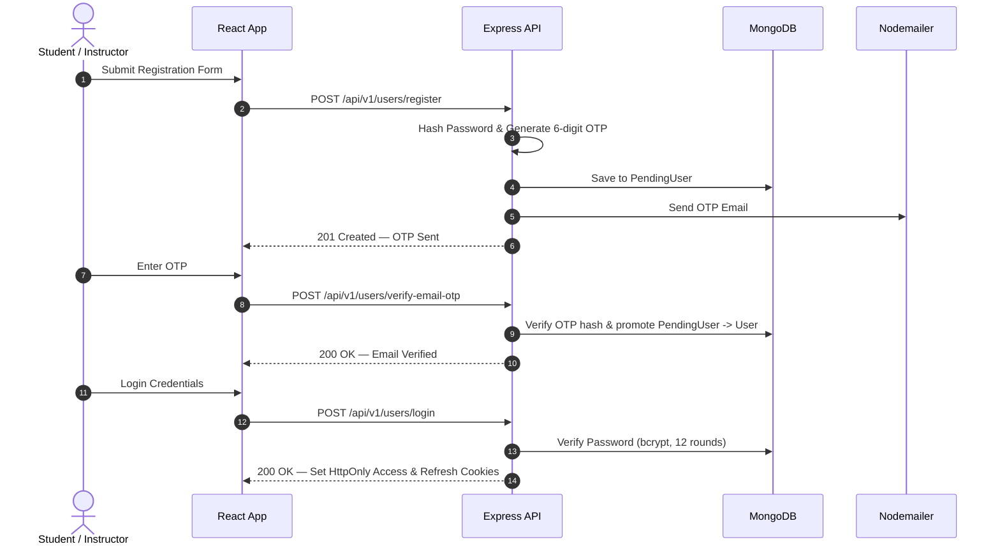
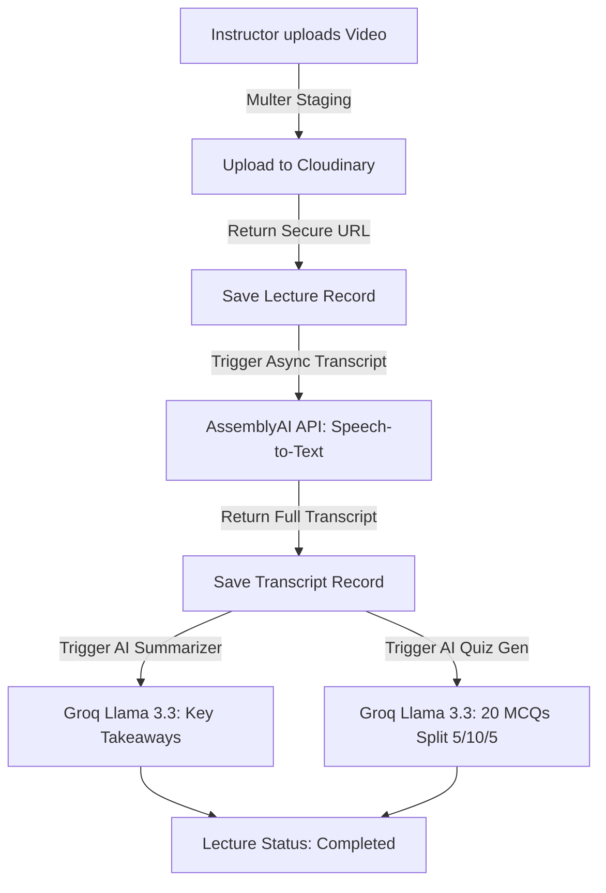

# EduNexus — Full-Stack E-Learning Platform

EduNexus is a modern, production-grade e-learning platform designed to bridge video learning, automated AI assistance, and seamless monetization for instructors and students. It features adaptive HLS video streaming, automated audio transcription powered by AssemblyAI, AI-generated multiple-choice quizzes and RAG doubt-clearing chatbot powered by Groq (Llama 3.3 70B), Razorpay payment processing with automated webhooks, course bundles, discount coupons, interactive discussion forums, completion certificates, and comprehensive revenue analytics for content creators.

---

## Table of Contents

1. [Key Features](#1-key-features)
2. [Tech Stack](#2-tech-stack)
3. [System Architecture](#3-system-architecture)
4. [Project Structure](#4-project-structure)
5. [Prerequisites](#5-prerequisites)
6. [Environment Variables](#6-environment-variables)
7. [Installation & Setup](#7-installation--setup)
8. [API Endpoint Overview](#8-api-endpoint-overview)
9. [Testing Setup](#9-testing-setup)
10. [Security Notes](#10-security-notes)
11. [Deployment Notes](#11-deployment-notes)
12. [Contributing](#12-contributing)
13. [License](#13-license)
14. [Author](#14-author)

---

## 1. Key Features

### 🎓 Student Experience
- **Course Discovery & Filtering**: Browse published courses by category, skill level, and price; search by keywords.
- **Interactive Video Player**: Stream lecture videos with adaptive HLS/MP4 playback via `react-player` and `hls.js`, complete with synchronized interactive transcript panels and timestamp seek functionality.
- **AI Doubt Assistant**: Interactive RAG chatbot (`Groq Llama-3.3-70b-versatile`) contextualized to the specific lecture transcript to answer student doubts instantly (50 daily messages quota).
- **Interactive Quizzes**: Take AI-generated or manually curated 20-question multiple-choice quizzes (5 Easy, 10 Medium, 5 Hard) with instant grading, score history, and detailed answer explanations.
- **Flexible Checkout**: Enroll in free courses instantly or purchase premium courses/bundles via Razorpay integration with coupon code discount redemption.
- **Course Discussions**: Threaded public Q&A forum on each lecture to ask questions and interact with instructors and peers.
- **Reviews & Ratings**: Rate courses, write detailed reviews, and browse peer feedback.
- **Certificates of Completion**: Automatically unlock customizable downloadable certificates of completion upon reaching 100% course progress.
- **Student Dashboard**: Track enrolled courses, completion percentages, quiz scores, and payment history in one place.

### 👨‍🏫 Instructor Suite
- **Course & Section Management**: Create, edit, publish, or archive courses with structured sections and lectures.
- **Video Upload Pipeline**: Upload video lectures via Multer to Cloudinary with automatic adaptive streaming (`m3u8` HLS profile) processing.
- **Automated AI Transcripts & Summaries**: One-click speech-to-text transcription via AssemblyAI (`universal-2` model) and AI key takeaway summaries via Groq (3–5 bullet points).
- **AI & Manual Quiz Generator**: Generate balanced 20-question quizzes automatically from lecture transcripts via Groq (tracked by daily quota: 5/day per course) or build custom quizzes with built-in difficulty split validation.
- **Coupons & Bundles**: Create custom percentage discount coupons (with usage limits and expiration dates) and bundle multiple courses at custom discounted prices (with dynamic pro-rata pricing for partially owned courses).
- **Revenue & Financial Analytics**: Comprehensive dashboard showing total earnings, monthly revenue charts, course breakdown, student counts, and transaction logs.
- **Refund Management**: Initiate full Razorpay refunds directly from the dashboard with automated enrollment revocation and email notification to students.

### 🛡️ Admin & Security Features
- **Account Moderation**: Admin account management, instructor account deactivation, and restoration flows (including auto-archiving/un-archiving courses).
- **Content Moderation**: Review and act on flagged reports regarding courses, reviews, or discussion posts.
- **Two-Factor Authentication (2FA)**: Optional email-based OTP 2FA during login for added user security.

---

## 2. Tech Stack

### Frontend
- **Framework**: React 19 + Vite 8
- **Routing**: React Router v7 (`react-router-dom`)
- **Styling**: Tailwind CSS v4 (`@tailwindcss/vite`), Radix UI primitives (`@radix-ui/react-progress`), Lucide React icons
- **Media Playback**: `react-player`, `hls.js`
- **Animations & Toast**: `framer-motion`, `react-hot-toast`
- **HTTP Client**: Axios (with credentials support for cookie-based auth)

### Backend
- **Runtime & Framework**: Node.js v22 (ES Modules) + Express.js v4
- **Database & ODM**: MongoDB + Mongoose ODM v9
- **Authentication & Security**: JWT (Access & Refresh tokens in HTTP-only cookies), bcrypt (12 rounds password hashing), Helmet, express-rate-limit, express-mongo-sanitize, CORS
- **File Uploads**: Multer (disk storage staging) + Cloudinary SDK (image/video/raw storage & HLS profile generation)

### Third-Party Services & AI Integrations
- **AssemblyAI**: Automated speech-to-text video transcription (`universal-2` model)
- **Groq SDK**: High-speed AI inference (`llama-3.3-70b-versatile`) for AI quiz generation and doubt-clearing chatbot
- **Razorpay**: Payment gateway integration, order creation, HMAC-SHA256 raw-body webhook handling, and refund processing
- **Nodemailer**: Transporter for OTP verification, password reset links, and refund notification emails

### DevOps & Testing
- **Containerization**: Docker & Docker Compose
- **Testing**: Vitest + Supertest + `mongodb-memory-server`

---

## 3. System Architecture

### High-Level Architecture Overview

```
                          ┌──────────────────────────┐
                          │   Client (React 19 SPA)  │
                          └─────────────┬────────────┘
                                        │ HTTP / REST / Cookies
                                        ▼
┌────────────────────────────────────────────────────────────────────────────────┐
│ Express API Gateway                                                            │
│ ┌───────────────┬─────────────────┬──────────┬───────────────┬───────────────┐ │
│ │ Helmet Header │ Global RateLim  │   CORS   │ MongoSanitize │ Error Handler │ │
│ └───────────────┴─────────────────┴──────────┴───────────────┴───────────────┘ │
└───────┬──────────────────────┬──────────────────────┬──────────────────┬───────┘
        │                      │                      │                  │
        ▼                      ▼                      ▼                  ▼
 ┌──────────────┐     ┌──────────────────┐   ┌─────────────────┐  ┌──────────────┐
 │  MongoDB     │     │    Cloudinary    │   │  AssemblyAI     │  │   Groq AI    │
 │ (Mongoose)   │     │ (Videos/Images)  │   │ (Transcriptions)│  │ (Quiz/Chat)  │
 └──────────────┘     └──────────────────┘   └─────────────────┘  └──────────────┘
        ▲                      ▲                      ▲                  ▲
        │                      │                      │                  │
 ┌──────┴──────┐      ┌────────┴─────────┐            │                  │
 │  Nodemailer │      │  Razorpay API    │────────────┘                  │
 │(SMTP Emails)│      │ (& Webhooks)     │───────────────────────────────┘
 └─────────────┘      └──────────────────┘
```

### Request Pipeline (`app.js`)
Every incoming HTTP request traverses the Express middleware chain in strict order:
1. **Helmet Security Headers**: Applied globally (with an exception path for the standalone backend password-reset page).
2. **Global Rate Limiter**: `express-rate-limit` (15-min window: 100 requests max in production / 1000 in dev).
3. **CORS Middleware**: Validates origins against `CORS_ORIGIN` with `credentials: true`.
4. **Razorpay Raw-Body Webhook Handler**: Route `/api/v1/payments/webhook` parses raw bytes with `express.raw({ type: "application/json" })` into `req.rawBody` before JSON parsing to preserve signature integrity.
5. **Body Parsers**: `express.json({ limit: "16kb" })` and `express.urlencoded({ extended: true, limit: "16kb" })`.
6. **Cookie Parser**: Reads access and refresh tokens from HTTP-only cookies.
7. **Mongo Sanitize**: Strips `$` and `.` characters to prevent NoSQL injection attacks.
8. **Module Routers**: 15 mounted feature routers under `/api/v1/...`.
9. **Centralized Error Handler**: Translates thrown `ApiError` exceptions into clean, standardized JSON responses.

---

### Core Workflows

#### 1. Authentication & User Lifecycle Flow

<img src="data:image/svg+xml;base64,PHN2ZyB2aWV3Qm94PSIwIDAgOTQwIDEwOTAiIHhtbG5zPSJodHRwOi8vd3d3LnczLm9yZy8yMDAwL3N2ZyIgZm9udC1mYW1pbHk9IlNlZ29lIFVJLCBIZWx2ZXRpY2EsIEFyaWFsLCBzYW5zLXNlcmlmIj4KPHJlY3QgeD0iMCIgeT0iMCIgd2lkdGg9Ijk0MCIgaGVpZ2h0PSIxMDkwIiBmaWxsPSIjMGQxMTE3Ii8+Cjx0ZXh0IHg9IjQ3MC4wIiB5PSIzNiIgdGV4dC1hbmNob3I9Im1pZGRsZSIgZmlsbD0iIzU4YTZmZiIgZm9udC1zaXplPSIyMSIgZm9udC13ZWlnaHQ9IjcwMCI+QXV0aGVudGljYXRpb24gJmFtcDsgVXNlciBMaWZlY3ljbGUgRmxvdzwvdGV4dD4KPHJlY3QgeD0iMjIuMCIgeT0iNzAiIHdpZHRoPSIxMTYiIGhlaWdodD0iMzQiIHJ4PSI2IiBmaWxsPSIjMTYxYjIyIiBzdHJva2U9IiMzZmI5NTAiIHN0cm9rZS13aWR0aD0iMS41Ii8+Cjx0ZXh0IHg9IjgwLjAiIHk9IjkyIiB0ZXh0LWFuY2hvcj0ibWlkZGxlIiBmaWxsPSIjYzlkMWQ5IiBmb250LXNpemU9IjE0IiBmb250LXdlaWdodD0iNjAwIj5Vc2VyPC90ZXh0Pgo8cmVjdCB4PSIyMi4wIiB5PSIxMDE2IiB3aWR0aD0iMTE2IiBoZWlnaHQ9IjM0IiByeD0iNiIgZmlsbD0iIzE2MWIyMiIgc3Ryb2tlPSIjM2ZiOTUwIiBzdHJva2Utd2lkdGg9IjEuNSIvPgo8dGV4dCB4PSI4MC4wIiB5PSIxMDM4IiB0ZXh0LWFuY2hvcj0ibWlkZGxlIiBmaWxsPSIjYzlkMWQ5IiBmb250LXNpemU9IjE0IiBmb250LXdlaWdodD0iNjAwIj5Vc2VyPC90ZXh0Pgo8bGluZSB4MT0iODAuMCIgeTE9IjEwNCIgeDI9IjgwLjAiIHkyPSIxMDE2IiBzdHJva2U9IiMzMDM2M2QiIHN0cm9rZS13aWR0aD0iMS41IiBzdHJva2UtZGFzaGFycmF5PSI0LDMiLz4KPHJlY3QgeD0iMjE3LjAiIHk9IjcwIiB3aWR0aD0iMTE2IiBoZWlnaHQ9IjM0IiByeD0iNiIgZmlsbD0iIzE2MWIyMiIgc3Ryb2tlPSIjM2ZiOTUwIiBzdHJva2Utd2lkdGg9IjEuNSIvPgo8dGV4dCB4PSIyNzUuMCIgeT0iOTIiIHRleHQtYW5jaG9yPSJtaWRkbGUiIGZpbGw9IiNjOWQxZDkiIGZvbnQtc2l6ZT0iMTQiIGZvbnQtd2VpZ2h0PSI2MDAiPkNsaWVudDwvdGV4dD4KPHJlY3QgeD0iMjE3LjAiIHk9IjEwMTYiIHdpZHRoPSIxMTYiIGhlaWdodD0iMzQiIHJ4PSI2IiBmaWxsPSIjMTYxYjIyIiBzdHJva2U9IiMzZmI5NTAiIHN0cm9rZS13aWR0aD0iMS41Ii8+Cjx0ZXh0IHg9IjI3NS4wIiB5PSIxMDM4IiB0ZXh0LWFuY2hvcj0ibWlkZGxlIiBmaWxsPSIjYzlkMWQ5IiBmb250LXNpemU9IjE0IiBmb250LXdlaWdodD0iNjAwIj5DbGllbnQ8L3RleHQ+CjxsaW5lIHgxPSIyNzUuMCIgeTE9IjEwNCIgeDI9IjI3NS4wIiB5Mj0iMTAxNiIgc3Ryb2tlPSIjMzAzNjNkIiBzdHJva2Utd2lkdGg9IjEuNSIgc3Ryb2tlLWRhc2hhcnJheT0iNCwzIi8+CjxyZWN0IHg9IjQxMi4wIiB5PSI3MCIgd2lkdGg9IjExNiIgaGVpZ2h0PSIzNCIgcng9IjYiIGZpbGw9IiMxNjFiMjIiIHN0cm9rZT0iIzNmYjk1MCIgc3Ryb2tlLXdpZHRoPSIxLjUiLz4KPHRleHQgeD0iNDcwLjAiIHk9IjkyIiB0ZXh0LWFuY2hvcj0ibWlkZGxlIiBmaWxsPSIjYzlkMWQ5IiBmb250LXNpemU9IjE0IiBmb250LXdlaWdodD0iNjAwIj5BUEk8L3RleHQ+CjxyZWN0IHg9IjQxMi4wIiB5PSIxMDE2IiB3aWR0aD0iMTE2IiBoZWlnaHQ9IjM0IiByeD0iNiIgZmlsbD0iIzE2MWIyMiIgc3Ryb2tlPSIjM2ZiOTUwIiBzdHJva2Utd2lkdGg9IjEuNSIvPgo8dGV4dCB4PSI0NzAuMCIgeT0iMTAzOCIgdGV4dC1hbmNob3I9Im1pZGRsZSIgZmlsbD0iI2M5ZDFkOSIgZm9udC1zaXplPSIxNCIgZm9udC13ZWlnaHQ9IjYwMCI+QVBJPC90ZXh0Pgo8bGluZSB4MT0iNDcwLjAiIHkxPSIxMDQiIHgyPSI0NzAuMCIgeTI9IjEwMTYiIHN0cm9rZT0iIzMwMzYzZCIgc3Ryb2tlLXdpZHRoPSIxLjUiIHN0cm9rZS1kYXNoYXJyYXk9IjQsMyIvPgo8cmVjdCB4PSI2MDcuMCIgeT0iNzAiIHdpZHRoPSIxMTYiIGhlaWdodD0iMzQiIHJ4PSI2IiBmaWxsPSIjMTYxYjIyIiBzdHJva2U9IiMzZmI5NTAiIHN0cm9rZS13aWR0aD0iMS41Ii8+Cjx0ZXh0IHg9IjY2NS4wIiB5PSI5MiIgdGV4dC1hbmNob3I9Im1pZGRsZSIgZmlsbD0iI2M5ZDFkOSIgZm9udC1zaXplPSIxNCIgZm9udC13ZWlnaHQ9IjYwMCI+REI8L3RleHQ+CjxyZWN0IHg9IjYwNy4wIiB5PSIxMDE2IiB3aWR0aD0iMTE2IiBoZWlnaHQ9IjM0IiByeD0iNiIgZmlsbD0iIzE2MWIyMiIgc3Ryb2tlPSIjM2ZiOTUwIiBzdHJva2Utd2lkdGg9IjEuNSIvPgo8dGV4dCB4PSI2NjUuMCIgeT0iMTAzOCIgdGV4dC1hbmNob3I9Im1pZGRsZSIgZmlsbD0iI2M5ZDFkOSIgZm9udC1zaXplPSIxNCIgZm9udC13ZWlnaHQ9IjYwMCI+REI8L3RleHQ+CjxsaW5lIHgxPSI2NjUuMCIgeTE9IjEwNCIgeDI9IjY2NS4wIiB5Mj0iMTAxNiIgc3Ryb2tlPSIjMzAzNjNkIiBzdHJva2Utd2lkdGg9IjEuNSIgc3Ryb2tlLWRhc2hhcnJheT0iNCwzIi8+CjxyZWN0IHg9IjgwMi4wIiB5PSI3MCIgd2lkdGg9IjExNiIgaGVpZ2h0PSIzNCIgcng9IjYiIGZpbGw9IiMxNjFiMjIiIHN0cm9rZT0iIzNmYjk1MCIgc3Ryb2tlLXdpZHRoPSIxLjUiLz4KPHRleHQgeD0iODYwLjAiIHk9IjkyIiB0ZXh0LWFuY2hvcj0ibWlkZGxlIiBmaWxsPSIjYzlkMWQ5IiBmb250LXNpemU9IjE0IiBmb250LXdlaWdodD0iNjAwIj5TTVRQPC90ZXh0Pgo8cmVjdCB4PSI4MDIuMCIgeT0iMTAxNiIgd2lkdGg9IjExNiIgaGVpZ2h0PSIzNCIgcng9IjYiIGZpbGw9IiMxNjFiMjIiIHN0cm9rZT0iIzNmYjk1MCIgc3Ryb2tlLXdpZHRoPSIxLjUiLz4KPHRleHQgeD0iODYwLjAiIHk9IjEwMzgiIHRleHQtYW5jaG9yPSJtaWRkbGUiIGZpbGw9IiNjOWQxZDkiIGZvbnQtc2l6ZT0iMTQiIGZvbnQtd2VpZ2h0PSI2MDAiPlNNVFA8L3RleHQ+CjxsaW5lIHgxPSI4NjAuMCIgeTE9IjEwNCIgeDI9Ijg2MC4wIiB5Mj0iMTAxNiIgc3Ryb2tlPSIjMzAzNjNkIiBzdHJva2Utd2lkdGg9IjEuNSIgc3Ryb2tlLWRhc2hhcnJheT0iNCwzIi8+Cjx0ZXh0IHg9IjE3Ny41IiB5PSIxNDAiIHRleHQtYW5jaG9yPSJtaWRkbGUiIGZpbGw9IiNjOWQxZDkiIGZvbnQtc2l6ZT0iMTIuNSI+U3VibWl0IFJlZ2lzdHJhdGlvbiBGb3JtPC90ZXh0Pgo8dGV4dCB4PSI1NC4wIiB5PSIxNTQiIHRleHQtYW5jaG9yPSJtaWRkbGUiIGZpbGw9IiM4Yjk0OWUiIGZvbnQtc2l6ZT0iMTEiIGZvbnQtd2VpZ2h0PSI3MDAiPjE8L3RleHQ+CjxsaW5lIHgxPSI4MC4wIiB5MT0iMTUwIiB4Mj0iMjY1LjAiIHkyPSIxNTAiIHN0cm9rZT0iIzc5YzBmZiIgc3Ryb2tlLXdpZHRoPSIxLjgiIC8+Cjxwb2x5Z29uIHBvaW50cz0iMjc1LjAsMTUwIDI2NS4wLDE0NSAyNjUuMCwxNTUiIGZpbGw9IiM3OWMwZmYiLz4KPHRleHQgeD0iMzcyLjUiIHk9IjIwMiIgdGV4dC1hbmNob3I9Im1pZGRsZSIgZmlsbD0iI2M5ZDFkOSIgZm9udC1zaXplPSIxMi41Ij5QT1NUIC9hcGkvdjEvdXNlcnMvcmVnaXN0ZXI8L3RleHQ+Cjx0ZXh0IHg9IjI0OS4wIiB5PSIyMTYiIHRleHQtYW5jaG9yPSJtaWRkbGUiIGZpbGw9IiM4Yjk0OWUiIGZvbnQtc2l6ZT0iMTEiIGZvbnQtd2VpZ2h0PSI3MDAiPjI8L3RleHQ+CjxsaW5lIHgxPSIyNzUuMCIgeTE9IjIxMiIgeDI9IjQ2MC4wIiB5Mj0iMjEyIiBzdHJva2U9IiM3OWMwZmYiIHN0cm9rZS13aWR0aD0iMS44IiAvPgo8cG9seWdvbiBwb2ludHM9IjQ3MC4wLDIxMiA0NjAuMCwyMDcgNDYwLjAsMjE3IiBmaWxsPSIjNzljMGZmIi8+Cjx0ZXh0IHg9IjU2MC4wIiB5PSIyNTAiIHRleHQtYW5jaG9yPSJtaWRkbGUiIGZpbGw9IiNjOWQxZDkiIGZvbnQtc2l6ZT0iMTIuNSI+SGFzaCBQYXNzd29yZCAmYW1wOyBHZW5lcmF0ZTwvdGV4dD4KPHRleHQgeD0iNTYwLjAiIHk9IjI2NCIgdGV4dC1hbmNob3I9Im1pZGRsZSIgZmlsbD0iI2M5ZDFkOSIgZm9udC1zaXplPSIxMi41Ij42LWRpZ2l0IE9UUDwvdGV4dD4KPHRleHQgeD0iNDQ4LjAiIHk9IjI3OCIgdGV4dC1hbmNob3I9Im1pZGRsZSIgZmlsbD0iIzhiOTQ5ZSIgZm9udC1zaXplPSIxMSIgZm9udC13ZWlnaHQ9IjcwMCI+MzwvdGV4dD4KPHBhdGggZD0iTSA0NzAuMCAyNzAgQyA1NDUuMCAyNjgsIDU0NS4wIDI5MCwgNDcwLjAgMjkyIiBmaWxsPSJub25lIiBzdHJva2U9IiNkMmE4ZmYiIHN0cm9rZS13aWR0aD0iMS44Ii8+Cjxwb2x5Z29uIHBvaW50cz0iNDc0LjAsMjkyIDQ4NS4wLDI4NyA0ODMuMCwyOTYiIGZpbGw9IiNkMmE4ZmYiLz4KPHRleHQgeD0iNTY3LjUiIHk9IjMxMiIgdGV4dC1hbmNob3I9Im1pZGRsZSIgZmlsbD0iI2M5ZDFkOSIgZm9udC1zaXplPSIxMi41Ij5TYXZlIHRvIFBlbmRpbmdVc2VyIChUVEw8L3RleHQ+Cjx0ZXh0IHg9IjU2Ny41IiB5PSIzMjYiIHRleHQtYW5jaG9yPSJtaWRkbGUiIGZpbGw9IiNjOWQxZDkiIGZvbnQtc2l6ZT0iMTIuNSI+aW5kZXgpPC90ZXh0Pgo8dGV4dCB4PSI0NDQuMCIgeT0iMzQwIiB0ZXh0LWFuY2hvcj0ibWlkZGxlIiBmaWxsPSIjOGI5NDllIiBmb250LXNpemU9IjExIiBmb250LXdlaWdodD0iNzAwIj40PC90ZXh0Pgo8bGluZSB4MT0iNDcwLjAiIHkxPSIzMzYiIHgyPSI2NTUuMCIgeTI9IjMzNiIgc3Ryb2tlPSIjNzljMGZmIiBzdHJva2Utd2lkdGg9IjEuOCIgLz4KPHBvbHlnb24gcG9pbnRzPSI2NjUuMCwzMzYgNjU1LjAsMzMxIDY1NS4wLDM0MSIgZmlsbD0iIzc5YzBmZiIvPgo8dGV4dCB4PSI2NjUuMCIgeT0iMzg4IiB0ZXh0LWFuY2hvcj0ibWlkZGxlIiBmaWxsPSIjYzlkMWQ5IiBmb250LXNpemU9IjEyLjUiPlNlbmQgT1RQIEVtYWlsPC90ZXh0Pgo8dGV4dCB4PSI0NDQuMCIgeT0iNDAyIiB0ZXh0LWFuY2hvcj0ibWlkZGxlIiBmaWxsPSIjOGI5NDllIiBmb250LXNpemU9IjExIiBmb250LXdlaWdodD0iNzAwIj41PC90ZXh0Pgo8bGluZSB4MT0iNDcwLjAiIHkxPSIzOTgiIHgyPSI4NTAuMCIgeTI9IjM5OCIgc3Ryb2tlPSIjNzljMGZmIiBzdHJva2Utd2lkdGg9IjEuOCIgLz4KPHBvbHlnb24gcG9pbnRzPSI4NjAuMCwzOTggODUwLjAsMzkzIDg1MC4wLDQwMyIgZmlsbD0iIzc5YzBmZiIvPgo8dGV4dCB4PSIzNzIuNSIgeT0iNDUwIiB0ZXh0LWFuY2hvcj0ibWlkZGxlIiBmaWxsPSIjYzlkMWQ5IiBmb250LXNpemU9IjEyLjUiPjIwMSBDcmVhdGVkIOKAlCBPVFAgU2VudDwvdGV4dD4KPHRleHQgeD0iMjQ5LjAiIHk9IjQ2NCIgdGV4dC1hbmNob3I9Im1pZGRsZSIgZmlsbD0iIzhiOTQ5ZSIgZm9udC1zaXplPSIxMSIgZm9udC13ZWlnaHQ9IjcwMCI+NjwvdGV4dD4KPGxpbmUgeDE9IjQ3MC4wIiB5MT0iNDYwIiB4Mj0iMjg1LjAiIHkyPSI0NjAiIHN0cm9rZT0iI2YwODgzZSIgc3Ryb2tlLXdpZHRoPSIxLjgiIHN0cm9rZS1kYXNoYXJyYXk9IjYsNCIvPgo8cG9seWdvbiBwb2ludHM9IjI3NS4wLDQ2MCAyODUuMCw0NTUgMjg1LjAsNDY1IiBmaWxsPSIjZjA4ODNlIi8+Cjx0ZXh0IHg9IjE3Ny41IiB5PSI1MTIiIHRleHQtYW5jaG9yPSJtaWRkbGUiIGZpbGw9IiNjOWQxZDkiIGZvbnQtc2l6ZT0iMTIuNSI+RW50ZXIgT1RQPC90ZXh0Pgo8dGV4dCB4PSI1NC4wIiB5PSI1MjYiIHRleHQtYW5jaG9yPSJtaWRkbGUiIGZpbGw9IiM4Yjk0OWUiIGZvbnQtc2l6ZT0iMTEiIGZvbnQtd2VpZ2h0PSI3MDAiPjc8L3RleHQ+CjxsaW5lIHgxPSI4MC4wIiB5MT0iNTIyIiB4Mj0iMjY1LjAiIHkyPSI1MjIiIHN0cm9rZT0iIzc5YzBmZiIgc3Ryb2tlLXdpZHRoPSIxLjgiIC8+Cjxwb2x5Z29uIHBvaW50cz0iMjc1LjAsNTIyIDI2NS4wLDUxNyAyNjUuMCw1MjciIGZpbGw9IiM3OWMwZmYiLz4KPHRleHQgeD0iMzcyLjUiIHk9IjU2MCIgdGV4dC1hbmNob3I9Im1pZGRsZSIgZmlsbD0iI2M5ZDFkOSIgZm9udC1zaXplPSIxMi41Ij5QT1NUIC9hcGkvdjEvdXNlcnMvdmVyaWZ5LTwvdGV4dD4KPHRleHQgeD0iMzcyLjUiIHk9IjU3NCIgdGV4dC1hbmNob3I9Im1pZGRsZSIgZmlsbD0iI2M5ZDFkOSIgZm9udC1zaXplPSIxMi41Ij5lbWFpbC1vdHA8L3RleHQ+Cjx0ZXh0IHg9IjI0OS4wIiB5PSI1ODgiIHRleHQtYW5jaG9yPSJtaWRkbGUiIGZpbGw9IiM4Yjk0OWUiIGZvbnQtc2l6ZT0iMTEiIGZvbnQtd2VpZ2h0PSI3MDAiPjg8L3RleHQ+CjxsaW5lIHgxPSIyNzUuMCIgeTE9IjU4NCIgeDI9IjQ2MC4wIiB5Mj0iNTg0IiBzdHJva2U9IiM3OWMwZmYiIHN0cm9rZS13aWR0aD0iMS44IiAvPgo8cG9seWdvbiBwb2ludHM9IjQ3MC4wLDU4NCA0NjAuMCw1NzkgNDYwLjAsNTg5IiBmaWxsPSIjNzljMGZmIi8+Cjx0ZXh0IHg9IjU2Ny41IiB5PSI2MjIiIHRleHQtYW5jaG9yPSJtaWRkbGUiIGZpbGw9IiNjOWQxZDkiIGZvbnQtc2l6ZT0iMTIuNSI+VmVyaWZ5IE9UUCBoYXNoICZhbXA7IHByb21vdGU8L3RleHQ+Cjx0ZXh0IHg9IjU2Ny41IiB5PSI2MzYiIHRleHQtYW5jaG9yPSJtaWRkbGUiIGZpbGw9IiNjOWQxZDkiIGZvbnQtc2l6ZT0iMTIuNSI+UGVuZGluZ1VzZXIgLSZndDsgVXNlcjwvdGV4dD4KPHRleHQgeD0iNDQ0LjAiIHk9IjY1MCIgdGV4dC1hbmNob3I9Im1pZGRsZSIgZmlsbD0iIzhiOTQ5ZSIgZm9udC1zaXplPSIxMSIgZm9udC13ZWlnaHQ9IjcwMCI+OTwvdGV4dD4KPGxpbmUgeDE9IjQ3MC4wIiB5MT0iNjQ2IiB4Mj0iNjU1LjAiIHkyPSI2NDYiIHN0cm9rZT0iIzc5YzBmZiIgc3Ryb2tlLXdpZHRoPSIxLjgiIC8+Cjxwb2x5Z29uIHBvaW50cz0iNjY1LjAsNjQ2IDY1NS4wLDY0MSA2NTUuMCw2NTEiIGZpbGw9IiM3OWMwZmYiLz4KPHRleHQgeD0iMzcyLjUiIHk9IjY5OCIgdGV4dC1hbmNob3I9Im1pZGRsZSIgZmlsbD0iI2M5ZDFkOSIgZm9udC1zaXplPSIxMi41Ij4yMDAgT0sg4oCUIEVtYWlsIFZlcmlmaWVkPC90ZXh0Pgo8dGV4dCB4PSIyNDkuMCIgeT0iNzEyIiB0ZXh0LWFuY2hvcj0ibWlkZGxlIiBmaWxsPSIjOGI5NDllIiBmb250LXNpemU9IjExIiBmb250LXdlaWdodD0iNzAwIj4xMDwvdGV4dD4KPGxpbmUgeDE9IjQ3MC4wIiB5MT0iNzA4IiB4Mj0iMjg1LjAiIHkyPSI3MDgiIHN0cm9rZT0iI2YwODgzZSIgc3Ryb2tlLXdpZHRoPSIxLjgiIHN0cm9rZS1kYXNoYXJyYXk9IjYsNCIvPgo8cG9seWdvbiBwb2ludHM9IjI3NS4wLDcwOCAyODUuMCw3MDMgMjg1LjAsNzEzIiBmaWxsPSIjZjA4ODNlIi8+Cjx0ZXh0IHg9IjE3Ny41IiB5PSI3NjAiIHRleHQtYW5jaG9yPSJtaWRkbGUiIGZpbGw9IiNjOWQxZDkiIGZvbnQtc2l6ZT0iMTIuNSI+TG9naW4gQ3JlZGVudGlhbHM8L3RleHQ+Cjx0ZXh0IHg9IjU0LjAiIHk9Ijc3NCIgdGV4dC1hbmNob3I9Im1pZGRsZSIgZmlsbD0iIzhiOTQ5ZSIgZm9udC1zaXplPSIxMSIgZm9udC13ZWlnaHQ9IjcwMCI+MTE8L3RleHQ+CjxsaW5lIHgxPSI4MC4wIiB5MT0iNzcwIiB4Mj0iMjY1LjAiIHkyPSI3NzAiIHN0cm9rZT0iIzc5YzBmZiIgc3Ryb2tlLXdpZHRoPSIxLjgiIC8+Cjxwb2x5Z29uIHBvaW50cz0iMjc1LjAsNzcwIDI2NS4wLDc2NSAyNjUuMCw3NzUiIGZpbGw9IiM3OWMwZmYiLz4KPHRleHQgeD0iMzcyLjUiIHk9IjgyMiIgdGV4dC1hbmNob3I9Im1pZGRsZSIgZmlsbD0iI2M5ZDFkOSIgZm9udC1zaXplPSIxMi41Ij5QT1NUIC9hcGkvdjEvdXNlcnMvbG9naW48L3RleHQ+Cjx0ZXh0IHg9IjI0OS4wIiB5PSI4MzYiIHRleHQtYW5jaG9yPSJtaWRkbGUiIGZpbGw9IiM4Yjk0OWUiIGZvbnQtc2l6ZT0iMTEiIGZvbnQtd2VpZ2h0PSI3MDAiPjEyPC90ZXh0Pgo8bGluZSB4MT0iMjc1LjAiIHkxPSI4MzIiIHgyPSI0NjAuMCIgeTI9IjgzMiIgc3Ryb2tlPSIjNzljMGZmIiBzdHJva2Utd2lkdGg9IjEuOCIgLz4KPHBvbHlnb24gcG9pbnRzPSI0NzAuMCw4MzIgNDYwLjAsODI3IDQ2MC4wLDgzNyIgZmlsbD0iIzc5YzBmZiIvPgo8dGV4dCB4PSI1NjcuNSIgeT0iODcwIiB0ZXh0LWFuY2hvcj0ibWlkZGxlIiBmaWxsPSIjYzlkMWQ5IiBmb250LXNpemU9IjEyLjUiPlZlcmlmeSBQYXNzd29yZCAoYmNyeXB0LCAxMjwvdGV4dD4KPHRleHQgeD0iNTY3LjUiIHk9Ijg4NCIgdGV4dC1hbmNob3I9Im1pZGRsZSIgZmlsbD0iI2M5ZDFkOSIgZm9udC1zaXplPSIxMi41Ij5yb3VuZHMpPC90ZXh0Pgo8dGV4dCB4PSI0NDQuMCIgeT0iODk4IiB0ZXh0LWFuY2hvcj0ibWlkZGxlIiBmaWxsPSIjOGI5NDllIiBmb250LXNpemU9IjExIiBmb250LXdlaWdodD0iNzAwIj4xMzwvdGV4dD4KPGxpbmUgeDE9IjQ3MC4wIiB5MT0iODk0IiB4Mj0iNjU1LjAiIHkyPSI4OTQiIHN0cm9rZT0iIzc5YzBmZiIgc3Ryb2tlLXdpZHRoPSIxLjgiIC8+Cjxwb2x5Z29uIHBvaW50cz0iNjY1LjAsODk0IDY1NS4wLDg4OSA2NTUuMCw4OTkiIGZpbGw9IiM3OWMwZmYiLz4KPHRleHQgeD0iMzcyLjUiIHk9IjkzMiIgdGV4dC1hbmNob3I9Im1pZGRsZSIgZmlsbD0iI2M5ZDFkOSIgZm9udC1zaXplPSIxMi41Ij4yMDAgT0sg4oCUIFNldCBIdHRwT25seSBBY2Nlc3MgJmFtcDs8L3RleHQ+Cjx0ZXh0IHg9IjM3Mi41IiB5PSI5NDYiIHRleHQtYW5jaG9yPSJtaWRkbGUiIGZpbGw9IiNjOWQxZDkiIGZvbnQtc2l6ZT0iMTIuNSI+UmVmcmVzaCBDb29raWVzPC90ZXh0Pgo8dGV4dCB4PSIyNDkuMCIgeT0iOTYwIiB0ZXh0LWFuY2hvcj0ibWlkZGxlIiBmaWxsPSIjOGI5NDllIiBmb250LXNpemU9IjExIiBmb250LXdlaWdodD0iNzAwIj4xNDwvdGV4dD4KPGxpbmUgeDE9IjQ3MC4wIiB5MT0iOTU2IiB4Mj0iMjg1LjAiIHkyPSI5NTYiIHN0cm9rZT0iI2YwODgzZSIgc3Ryb2tlLXdpZHRoPSIxLjgiIHN0cm9rZS1kYXNoYXJyYXk9IjYsNCIvPgo8cG9seWdvbiBwb2ludHM9IjI3NS4wLDk1NiAyODUuMCw5NTEgMjg1LjAsOTYxIiBmaWxsPSIjZjA4ODNlIi8+Cjwvc3ZnPg==" alt="Authentication & User Lifecycle Flow" width="100%"/>

<details>
<summary>Mermaid source (for viewers that render Mermaid natively)</summary>


</details>

#### 2. Course Creation, Video Upload & AI Processing Pipeline

<img src="data:image/svg+xml;base64,PHN2ZyB2aWV3Qm94PSIwIDAgNzgwIDc2MiIgeG1sbnM9Imh0dHA6Ly93d3cudzMub3JnLzIwMDAvc3ZnIiBmb250LWZhbWlseT0iU2Vnb2UgVUksIEhlbHZldGljYSwgQXJpYWwsIHNhbnMtc2VyaWYiPgo8cmVjdCB4PSIwIiB5PSIwIiB3aWR0aD0iNzgwIiBoZWlnaHQ9Ijc2MiIgZmlsbD0iIzBkMTExNyIvPgo8dGV4dCB4PSIzOTAuMCIgeT0iMzYiIHRleHQtYW5jaG9yPSJtaWRkbGUiIGZpbGw9IiM1OGE2ZmYiIGZvbnQtc2l6ZT0iMjAiIGZvbnQtd2VpZ2h0PSI3MDAiPkNvdXJzZSBDcmVhdGlvbiwgVmlkZW8gVXBsb2FkICZhbXA7IEFJIFByb2Nlc3NpbmcgUGlwZWxpbmU8L3RleHQ+CjxyZWN0IHg9IjgwLjAiIHk9IjcwIiB3aWR0aD0iNjIwIiBoZWlnaHQ9IjU2IiByeD0iMTAiIGZpbGw9IiMxNjFiMjIiIHN0cm9rZT0iIzNmYjk1MCIgc3Ryb2tlLXdpZHRoPSIxLjYiLz4KPHRleHQgeD0iMzkwLjAiIHk9IjEwMy4wIiB0ZXh0LWFuY2hvcj0ibWlkZGxlIiBmaWxsPSIjYzlkMWQ5IiBmb250LXNpemU9IjEzLjUiPkluc3RydWN0b3IgdXBsb2FkcyBsZWN0dXJlIHZpZGVvPC90ZXh0Pgo8cmVjdCB4PSI4MC4wIiB5PSIxNjYiIHdpZHRoPSI2MjAiIGhlaWdodD0iNTYiIHJ4PSIxMCIgZmlsbD0iIzE2MWIyMiIgc3Ryb2tlPSIjM2ZiOTUwIiBzdHJva2Utd2lkdGg9IjEuNiIvPgo8dGV4dCB4PSIzOTAuMCIgeT0iMTkxLjAiIHRleHQtYW5jaG9yPSJtaWRkbGUiIGZpbGw9IiNjOWQxZDkiIGZvbnQtc2l6ZT0iMTMuNSI+TXVsdGVyIHN0YWdlcyBmaWxlIC0mZ3Q7IENsb3VkaW5hcnkgdXBsb2FkPC90ZXh0Pgo8dGV4dCB4PSIzOTAuMCIgeT0iMjA3LjAiIHRleHQtYW5jaG9yPSJtaWRkbGUiIGZpbGw9IiNjOWQxZDkiIGZvbnQtc2l6ZT0iMTMuNSI+KHNlY3VyZSBVUkwgKyBITFMgcHJvZmlsZSk8L3RleHQ+CjxyZWN0IHg9IjgwLjAiIHk9IjI2MiIgd2lkdGg9IjYyMCIgaGVpZ2h0PSI1NiIgcng9IjEwIiBmaWxsPSIjMTYxYjIyIiBzdHJva2U9IiMzZmI5NTAiIHN0cm9rZS13aWR0aD0iMS42Ii8+Cjx0ZXh0IHg9IjM5MC4wIiB5PSIyOTUuMCIgdGV4dC1hbmNob3I9Im1pZGRsZSIgZmlsbD0iI2M5ZDFkOSIgZm9udC1zaXplPSIxMy41Ij5TYXZlIExlY3R1cmUgcmVjb3JkIChzdGF0dXM6IHBlbmRpbmcpPC90ZXh0Pgo8cmVjdCB4PSI4MC4wIiB5PSIzNTgiIHdpZHRoPSI2MjAiIGhlaWdodD0iNTYiIHJ4PSIxMCIgZmlsbD0iIzE2MWIyMiIgc3Ryb2tlPSIjM2ZiOTUwIiBzdHJva2Utd2lkdGg9IjEuNiIvPgo8dGV4dCB4PSIzOTAuMCIgeT0iMzgzLjAiIHRleHQtYW5jaG9yPSJtaWRkbGUiIGZpbGw9IiNjOWQxZDkiIGZvbnQtc2l6ZT0iMTMuNSI+QXNzZW1ibHlBSTogYXN5bmMgc3BlZWNoLXRvLXRleHQ8L3RleHQ+Cjx0ZXh0IHg9IjM5MC4wIiB5PSIzOTkuMCIgdGV4dC1hbmNob3I9Im1pZGRsZSIgZmlsbD0iI2M5ZDFkOSIgZm9udC1zaXplPSIxMy41Ij50cmFuc2NyaXB0aW9uPC90ZXh0Pgo8cmVjdCB4PSI4MC4wIiB5PSI0NTQiIHdpZHRoPSI2MjAiIGhlaWdodD0iNTYiIHJ4PSIxMCIgZmlsbD0iIzE2MWIyMiIgc3Ryb2tlPSIjM2ZiOTUwIiBzdHJva2Utd2lkdGg9IjEuNiIvPgo8dGV4dCB4PSIzOTAuMCIgeT0iNDg3LjAiIHRleHQtYW5jaG9yPSJtaWRkbGUiIGZpbGw9IiNjOWQxZDkiIGZvbnQtc2l6ZT0iMTMuNSI+U2F2ZSBUcmFuc2NyaXB0IHJlY29yZDwvdGV4dD4KPHJlY3QgeD0iMzUuMCIgeT0iNTUwIiB3aWR0aD0iMzMwIiBoZWlnaHQ9IjU2IiByeD0iMTAiIGZpbGw9IiMxNjFiMjIiIHN0cm9rZT0iIzNmYjk1MCIgc3Ryb2tlLXdpZHRoPSIxLjYiLz4KPHRleHQgeD0iMjAwLjAiIHk9IjU2Ny4wIiB0ZXh0LWFuY2hvcj0ibWlkZGxlIiBmaWxsPSIjYzlkMWQ5IiBmb250LXNpemU9IjEzLjUiPkdyb3EgKExsYW1hIDMuMyk6IGdlbmVyYXRlPC90ZXh0Pgo8dGV4dCB4PSIyMDAuMCIgeT0iNTgzLjAiIHRleHQtYW5jaG9yPSJtaWRkbGUiIGZpbGw9IiNjOWQxZDkiIGZvbnQtc2l6ZT0iMTMuNSI+M+KAkzUgYnVsbGV0IGtleS10YWtlYXdheTwvdGV4dD4KPHRleHQgeD0iMjAwLjAiIHk9IjU5OS4wIiB0ZXh0LWFuY2hvcj0ibWlkZGxlIiBmaWxsPSIjYzlkMWQ5IiBmb250LXNpemU9IjEzLjUiPnN1bW1hcnk8L3RleHQ+CjxyZWN0IHg9IjQxNS4wIiB5PSI1NTAiIHdpZHRoPSIzMzAiIGhlaWdodD0iNTYiIHJ4PSIxMCIgZmlsbD0iIzE2MWIyMiIgc3Ryb2tlPSIjM2ZiOTUwIiBzdHJva2Utd2lkdGg9IjEuNiIvPgo8dGV4dCB4PSI1ODAuMCIgeT0iNTY3LjAiIHRleHQtYW5jaG9yPSJtaWRkbGUiIGZpbGw9IiNjOWQxZDkiIGZvbnQtc2l6ZT0iMTMuNSI+R3JvcSAoTGxhbWEgMy4zKTogZ2VuZXJhdGU8L3RleHQ+Cjx0ZXh0IHg9IjU4MC4wIiB5PSI1ODMuMCIgdGV4dC1hbmNob3I9Im1pZGRsZSIgZmlsbD0iI2M5ZDFkOSIgZm9udC1zaXplPSIxMy41Ij4yMC1xdWVzdGlvbiBxdWl6ICg1IGVhc3kgLzwvdGV4dD4KPHRleHQgeD0iNTgwLjAiIHk9IjU5OS4wIiB0ZXh0LWFuY2hvcj0ibWlkZGxlIiBmaWxsPSIjYzlkMWQ5IiBmb250LXNpemU9IjEzLjUiPjEwIG1lZGl1bSAvIDUgaGFyZCk8L3RleHQ+CjxyZWN0IHg9IjgwLjAiIHk9IjY0NiIgd2lkdGg9IjYyMCIgaGVpZ2h0PSI1NiIgcng9IjEwIiBmaWxsPSIjMTYxYjIyIiBzdHJva2U9IiMzZmI5NTAiIHN0cm9rZS13aWR0aD0iMS42Ii8+Cjx0ZXh0IHg9IjM5MC4wIiB5PSI2NzkuMCIgdGV4dC1hbmNob3I9Im1pZGRsZSIgZmlsbD0iI2M5ZDFkOSIgZm9udC1zaXplPSIxMy41Ij5MZWN0dXJlIHN0YXR1czogY29tcGxldGVkPC90ZXh0Pgo8bGluZSB4MT0iMzkwLjAiIHkxPSIxMjYiIHgyPSIzOTAuMCIgeTI9IjE1NiIgc3Ryb2tlPSIjNzljMGZmIiBzdHJva2Utd2lkdGg9IjEuOCIvPgo8cG9seWdvbiBwb2ludHM9IjM5MC4wLDE2NiAzODQuMCwxNTYgMzk2LjAsMTU2IiBmaWxsPSIjNzljMGZmIi8+CjxyZWN0IHg9IjMwMC4wIiB5PSIxMzYuMCIgd2lkdGg9IjE4MCIgaGVpZ2h0PSIxNiIgZmlsbD0iIzBkMTExNyIvPgo8dGV4dCB4PSIzOTAuMCIgeT0iMTQ4LjAiIHRleHQtYW5jaG9yPSJtaWRkbGUiIGZpbGw9IiM4Yjk0OWUiIGZvbnQtc2l6ZT0iMTEuNSI+VXBsb2FkPC90ZXh0Pgo8bGluZSB4MT0iMzkwLjAiIHkxPSIyMjIiIHgyPSIzOTAuMCIgeTI9IjI1MiIgc3Ryb2tlPSIjNzljMGZmIiBzdHJva2Utd2lkdGg9IjEuOCIvPgo8cG9seWdvbiBwb2ludHM9IjM5MC4wLDI2MiAzODQuMCwyNTIgMzk2LjAsMjUyIiBmaWxsPSIjNzljMGZmIi8+CjxyZWN0IHg9IjMwMC4wIiB5PSIyMzIuMCIgd2lkdGg9IjE4MCIgaGVpZ2h0PSIxNiIgZmlsbD0iIzBkMTExNyIvPgo8dGV4dCB4PSIzOTAuMCIgeT0iMjQ0LjAiIHRleHQtYW5jaG9yPSJtaWRkbGUiIGZpbGw9IiM4Yjk0OWUiIGZvbnQtc2l6ZT0iMTEuNSI+UmV0dXJuIHNlY3VyZSBVUkw8L3RleHQ+CjxsaW5lIHgxPSIzOTAuMCIgeTE9IjMxOCIgeDI9IjM5MC4wIiB5Mj0iMzQ4IiBzdHJva2U9IiM3OWMwZmYiIHN0cm9rZS13aWR0aD0iMS44Ii8+Cjxwb2x5Z29uIHBvaW50cz0iMzkwLjAsMzU4IDM4NC4wLDM0OCAzOTYuMCwzNDgiIGZpbGw9IiM3OWMwZmYiLz4KPHJlY3QgeD0iMzAwLjAiIHk9IjMyOC4wIiB3aWR0aD0iMTgwIiBoZWlnaHQ9IjE2IiBmaWxsPSIjMGQxMTE3Ii8+Cjx0ZXh0IHg9IjM5MC4wIiB5PSIzNDAuMCIgdGV4dC1hbmNob3I9Im1pZGRsZSIgZmlsbD0iIzhiOTQ5ZSIgZm9udC1zaXplPSIxMS41Ij5UcmlnZ2VyIGFzeW5jIHRyYW5zY3JpcHQgam9iPC90ZXh0Pgo8bGluZSB4MT0iMzkwLjAiIHkxPSI0MTQiIHgyPSIzOTAuMCIgeTI9IjQ0NCIgc3Ryb2tlPSIjNzljMGZmIiBzdHJva2Utd2lkdGg9IjEuOCIvPgo8cG9seWdvbiBwb2ludHM9IjM5MC4wLDQ1NCAzODQuMCw0NDQgMzk2LjAsNDQ0IiBmaWxsPSIjNzljMGZmIi8+CjxyZWN0IHg9IjMwMC4wIiB5PSI0MjQuMCIgd2lkdGg9IjE4MCIgaGVpZ2h0PSIxNiIgZmlsbD0iIzBkMTExNyIvPgo8dGV4dCB4PSIzOTAuMCIgeT0iNDM2LjAiIHRleHQtYW5jaG9yPSJtaWRkbGUiIGZpbGw9IiM4Yjk0OWUiIGZvbnQtc2l6ZT0iMTEuNSI+UmV0dXJuIGZ1bGwgdHJhbnNjcmlwdDwvdGV4dD4KPGxpbmUgeDE9IjM5MC4wIiB5MT0iNTEwIiB4Mj0iMjAwLjAiIHkyPSI1NDAiIHN0cm9rZT0iIzc5YzBmZiIgc3Ryb2tlLXdpZHRoPSIxLjgiLz4KPHBvbHlnb24gcG9pbnRzPSIyMDAuMCw1NTAgMTk0LjAsNTQwIDIwNi4wLDU0MCIgZmlsbD0iIzc5YzBmZiIvPgo8cmVjdCB4PSIyMDUuMCIgeT0iNTIwLjAiIHdpZHRoPSIxODAiIGhlaWdodD0iMTYiIGZpbGw9IiMwZDExMTciLz4KPHRleHQgeD0iMjk1LjAiIHk9IjUzMi4wIiB0ZXh0LWFuY2hvcj0ibWlkZGxlIiBmaWxsPSIjOGI5NDllIiBmb250LXNpemU9IjExLjUiPlRyaWdnZXIgQUkgc3VtbWFyaXplcjwvdGV4dD4KPGxpbmUgeDE9IjM5MC4wIiB5MT0iNTEwIiB4Mj0iNTgwLjAiIHkyPSI1NDAiIHN0cm9rZT0iIzc5YzBmZiIgc3Ryb2tlLXdpZHRoPSIxLjgiLz4KPHBvbHlnb24gcG9pbnRzPSI1ODAuMCw1NTAgNTc0LjAsNTQwIDU4Ni4wLDU0MCIgZmlsbD0iIzc5YzBmZiIvPgo8cmVjdCB4PSIzOTUuMCIgeT0iNTIwLjAiIHdpZHRoPSIxODAiIGhlaWdodD0iMTYiIGZpbGw9IiMwZDExMTciLz4KPHRleHQgeD0iNDg1LjAiIHk9IjUzMi4wIiB0ZXh0LWFuY2hvcj0ibWlkZGxlIiBmaWxsPSIjOGI5NDllIiBmb250LXNpemU9IjExLjUiPlRyaWdnZXIgQUkgcXVpeiBnZW5lcmF0aW9uPC90ZXh0Pgo8cGF0aCBkPSJNIDIwMC4wIDYwNiBMIDIwMC4wIDYyNiBMIDM5MC4wIDYyNiBMIDM5MC4wIDYzNiIgZmlsbD0ibm9uZSIgc3Ryb2tlPSIjNzljMGZmIiBzdHJva2Utd2lkdGg9IjEuOCIvPgo8cG9seWdvbiBwb2ludHM9IjM5MC4wLDY0NiAzODQuMCw2MzYgMzk2LjAsNjM2IiBmaWxsPSIjNzljMGZmIi8+CjxwYXRoIGQ9Ik0gNTgwLjAgNjA2IEwgNTgwLjAgNjI2IEwgMzkwLjAgNjI2IEwgMzkwLjAgNjM2IiBmaWxsPSJub25lIiBzdHJva2U9IiM3OWMwZmYiIHN0cm9rZS13aWR0aD0iMS44Ii8+Cjxwb2x5Z29uIHBvaW50cz0iMzkwLjAsNjQ2IDM4NC4wLDYzNiAzOTYuMCw2MzYiIGZpbGw9IiM3OWMwZmYiLz4KPC9zdmc+" alt="Course Creation, Video Upload & AI Processing Pipeline" width="100%"/>

<details>
<summary>Mermaid source (for viewers that render Mermaid natively)</summary>


</details>

#### 3. Razorpay Payment & Webhook Verification Flow
1. **Order Creation**: Client calls `POST /api/v1/payments/create-order/:courseId`. Backend creates a Razorpay order via SDK and inserts a `Payment` record with status `pending`.
2. **Client Checkout**: Client renders Razorpay Checkout modal.
3. **Webhook Confirmation (Reliable Async path)**: Razorpay triggers `POST /api/v1/payments/webhook`. Backend reads `req.rawBody` and verifies the `x-razorpay-signature` header against `RAZORPAY_WEBHOOK_SECRET` using HMAC SHA-256. Upon signature match for `payment.captured`, `createEnrollment()` grants course access even if client callback is interrupted.
4. **Client Verification Callback**: Client submits payment signatures to `POST /api/v1/payments/verify` as an immediate user-facing confirmation fallback.

---

### Data Layer Overview (Mongoose Models)

- **`User`**: Account credentials, role (`student`, `instructor`), profile details, enrolled courses, 2FA settings, and daily chatbot quota tracking.
- **`Course`**: Course metadata, category, level, pricing, publication/archive flags, instructor ref, and daily AI generation quota counters.
- **`Lecture`**: Video URL, public ID, duration, section grouping, free-preview flag, and processing status (`pending`, `transcribing`, `generating_quiz`, `completed`, `failed`).
- **`Transcript`**: Full transcript text, AssemblyAI reference ID, word-level timestamps, confidence scores, and AI summary takeaways.
- **`Quiz` & `QuizAttempt`**: 20-question quiz sets with 5/10/5 difficulty distribution, generated flag, and student attempt scoring logs.
- **`Enrollment`**: Links students to courses with completion tracking, completed lecture lists, and active status.
- **`Payment`**: Razorpay order/payment IDs, amount, currency, coupon details, status (`pending`, `completed`, `refunded`), and bundle association.
- **`Coupon`**: Course discount codes, percentage, max usage limits, expiration dates, and usage counters.
- **`Bundle`**: Grouped courses sold at a package price.
- **`Review`**, **`Discussion`**, **`Report`**: Community reviews, threaded lecture discussions, and user content moderation reports.

---

## 4. Project Structure

EduNexus uses a modular monorepo structure separating frontend UI components from backend business domains:

```
edunexus/
├── backend/
│   ├── src/
│   │   ├── app.js                   # Main Express application & middleware setup
│   │   ├── index.js                 # Server entry point & DB connection
│   │   ├── db/                      # MongoDB connection setup
│   │   ├── middlewares/             # Security, auth, role, rateLimit, error, multer
│   │   ├── services/                # Cross-module shared domain services (enrollment)
│   │   ├── utils/                   # Cloudinary, Groq, JWT, Email, ApiError, ApiResponse
│   │   └── modules/                 # Feature-based modular architecture
│   │       ├── user/                # Auth, Profile, 2FA, OTP, Reset Password
│   │       ├── course/              # Course CRUD, filtering, section management
│   │       ├── lecture/             # Video uploads, streaming details
│   │       ├── transcript/          # AssemblyAI integration & summary extraction
│   │       ├── quiz/                # AI quiz generation, manual quiz editor, attempts
│   │       ├── enrollment/          # Enrollment claims & progress tracking
│   │       ├── payment/             # Razorpay orders, webhooks, refunds, bundle orders
│   │       ├── revenue/             # Instructor revenue dashboard & stats
│   │       ├── chatbot/             # Groq RAG doubt assistant with quota limit
│   │       ├── review/              # Course ratings and reviews
│   │       ├── discussion/          # Threaded lecture Q&A discussions
│   │       ├── coupon/              # Discount coupon management
│   │       ├── bundle/              # Course bundle packages
│   │       └── report/              # User reporting & moderation
│   ├── test/                        # Vitest test suite + mongodb-memory-server
│   ├── Dockerfile
│   └── package.json
├── frontend/
│   ├── src/
│   │   ├── main.jsx                 # React root mounting
│   │   ├── App.jsx                  # React Router routes & context layout
│   │   ├── lib/                     # Axios instance & API helper utilities
│   │   └── modules/                 # Modular feature pages & components
│   │       ├── auth/                # Login, Register, OTP Modal, Reset Password
│   │       ├── course/              # Catalog, Detail, Creation & Management views
│   │       ├── lecture/             # Player UI, Transcript panel, Notes tab
│   │       ├── quiz/                # Quiz player, result breakdown, instructor editor
│   │       ├── chatbot/             # Floating doubt assistant chat drawer
│   │       ├── user/                # Student dashboard, Instructor stats, Settings
│   │       ├── certificate/         # Certificate viewer & download PDF/print view
│   │       ├── bundle/              # Bundle purchase & detail pages
│   │       ├── report/              # Flag modal & report resolution view
│   │       └── shared/              # Navbar, Footer, UI components
│   ├── Dockerfile
│   └── package.json
├── docker-compose.yml
└── README.md
```

---

## 5. Prerequisites

Before installing, ensure you have the following installed on your machine:
- **Node.js**: `v18.x` or higher (developed and tested on `v22.x`; no `engines` field is enforced in `package.json`)
- **npm**: a recent version matching your Node install
- **MongoDB**: Local MongoDB instance (`mongodb://localhost:27017`) or MongoDB Atlas URI
- **Docker & Docker Compose** *(Optional, for containerized deployment)*

### Third-Party Accounts & Credentials
- **Cloudinary**: For hosting lecture videos, thumbnails, and PDF attachments.
- **Razorpay Account**: For payment order creation and webhook verification.
- **AssemblyAI API Key**: For video transcriptions.
- **Groq API Key**: For AI quiz generation and RAG chatbot (`llama-3.3-70b-versatile`).
- **SMTP Provider**: Email credentials (e.g. Gmail App Password or SendGrid) for OTPs and notifications.

---

## 6. Environment Variables

Create a `.env` file inside the `backend/` directory based on `backend/.env.example`:

| Environment Variable | Description |
|---|---|
| `PORT` | Port number the backend server runs on (default: `8000`). |
| `MONGODB_URL` | MongoDB connection URI string. |
| `CORS_ORIGIN` | Allowed client origin for CORS (e.g. `http://localhost:5173`). |
| `NODE_ENV` | Application environment (`development`, `production`, or `test`). |
| `CLOUDINARY_CLOUD_NAME` | Cloudinary Cloud Name. |
| `CLOUDINARY_API_KEY` | Cloudinary API Key. |
| `CLOUDINARY_API_SECRET` | Cloudinary API Secret. |
| `ACCESS_TOKEN_SECRET` | Secret key used to sign JWT Access Tokens. |
| `ACCESS_TOKEN_EXPIRY` | Expiration time for Access Tokens (e.g. `1d`). |
| `REFRESH_TOKEN_SECRET` | Secret key used to sign JWT Refresh Tokens. |
| `REFRESH_TOKEN_EXPIRY` | Expiration time for Refresh Tokens (e.g. `10d`). |
| `BACKEND_URL` | Public base URL of the backend API (used for password reset links). |
| `FRONTEND_URL` | Public URL of the frontend SPA (used for CORS and redirect links). |
| `EMAIL_USER` | SMTP email sender address for Nodemailer. |
| `EMAIL_PASS` | SMTP email application password. |
| `ASSEMBLYAI_API_KEY` | API key for AssemblyAI transcription service. |
| `GROQ_API_KEY` | API key for Groq Cloud SDK. |
| `RAZORPAY_KEY_ID` | Razorpay Key ID. |
| `RAZORPAY_KEY_SECRET` | Razorpay Key Secret. |
| `RAZORPAY_WEBHOOK_SECRET` | Razorpay Webhook Secret configured in Razorpay Dashboard. |

---

## 7. Installation & Setup

### Option A: Local Development Setup

#### 1. Clone the Repository
```bash
git clone https://github.com/Vedant07022006/Edunexus-Platform.git
cd Edunexus-Platform
```

#### 2. Backend Setup
```bash
cd backend
npm install
cp .env.example .env
# Edit .env and supply your connection strings and API keys
npm run dev
```
The backend API server will start on **`http://localhost:8000`**.

#### 3. Frontend Setup
In a new terminal window:
```bash
cd frontend
npm install
npm run dev
```
The Vite development server will start on **`http://localhost:5173`**.

---

### Option B: Docker Compose (One-Command Setup)

To run both services seamlessly in containerized environments:

1. Ensure `backend/.env` exists and has valid configurations.
2. Run Docker Compose from the root directory:
```bash
docker-compose up --build
```
- **Backend Service**: Available on `http://localhost:8000`
- **Frontend Service**: Available on `http://localhost:5173`

---

## 8. API Endpoint Overview

All API routes are mounted under the `/api/v1` base path in `app.js`:

| Route Prefix | Module / Purpose | Key Operations |
|---|---|---|
| `/api/v1/users` | User & Auth Management | Register, Verify OTP, Login, Logout, Refresh Token, 2FA, Reset Password, Profile. |
| `/api/v1/courses` | Course Catalog & Management | Create, edit, publish, search, filter, and archive courses. |
| `/api/v1/lectures` | Lecture Management | Add lectures, upload video media via Multer, stream lecture data. |
| `/api/v1/transcripts` | Speech-to-Text Transcripts | Generate AssemblyAI transcript, extract AI takeaways, fetch transcript timestamps. |
| `/api/v1/quizzes` | Quiz Management | Generate AI 20-MCQ quizzes, edit quizzes manually, check daily quota. |
| `/api/v1/quiz-attempts` | Quiz Evaluation | Submit quiz attempts, compute scores, view detailed solution breakdowns. |
| `/api/v1/enrollments` | Student Enrollments | Enroll in free/paid courses, track video completion, issue certificates. |
| `/api/v1/payments` | Razorpay Payments | Create order, verify payment signature, process webhooks, execute refunds. |
| `/api/v1/revenue` | Instructor Revenue Stats | View instructor earnings summaries, monthly trends, and transaction history. |
| `/api/v1/chatbot` | AI Doubt Assistant | Ask doubt questions to Groq Llama 3.3, track 50-message daily usage quota. |
| `/api/v1/reviews` | Course Reviews | Submit ratings & written feedback, list course reviews. |
| `/api/v1/discussions` | Discussion Forum | Post lecture questions, submit threaded replies, mark answered status. |
| `/api/v1/coupons` | Discount Coupons | Create discount codes, validate coupon eligibility during checkout. |
| `/api/v1/bundles` | Course Bundles | Create multi-course packages, calculate dynamic unowned course prices. |
| `/api/v1/reports` | Content Moderation | Flag inappropriate content, admin resolution workflows. |

---

## 9. Testing Setup

The backend test suite is built with **Vitest**, **Supertest**, and **`mongodb-memory-server`**, enabling isolated integration testing without needing an external MongoDB instance or making live third-party API calls.

### Running Tests
Navigate to the `backend/` directory:

```bash
# Run all integration tests once
npm run test

# Run tests in watch mode during development
npm run test:watch

# Generate test coverage reports
npm run test:coverage
```

### Test Suite Highlights
- **In-Memory Database**: `MongoMemoryServer` initializes automatically in `test/setup.js` before tests run and wipes collections between test files.
- **Mocked External APIs**: Mock wrappers for Nodemailer, Cloudinary, Razorpay, AssemblyAI, and Groq SDK prevent external network side effects during testing.

---

## 10. Security Notes

- **HTTP Security Headers**: Powered by `helmet()` to enforce CSP, frameguard, and XSS filtering.
- **Rate Limiting**: Protects against brute-force and Denial-of-Service attacks with `express-rate-limit`.
- **NoSQL Injection Defense**: `express-mongo-sanitize` strips malicious operator keys from request bodies, queries, and params.
- **Secure Token Strategy**: Short-lived Access Tokens paired with long-lived Refresh Tokens stored in `httpOnly`, `sameSite: strict`, `secure` cookies.
- **Webhook Integrity**: Razorpay webhook signatures are validated using HMAC-SHA256 over raw request buffers (`req.rawBody`) before JSON parsing.

---

## 11. Deployment Notes

- **Dockerized Containers**: Built using multi-stage lightweight Node 22 Alpine images (`node:22-alpine`).
- **Production Environment**: When deploying to production environments (e.g. AWS ECS, Render, DigitalOcean):
  1. Set `NODE_ENV=production` in environment configuration.
  2. Set `BACKEND_URL` and `FRONTEND_URL` to match your domain names.
  3. Ensure `RAZORPAY_WEBHOOK_SECRET` is set and registered in the Razorpay Dashboard.

---

## 12. Contributing

1. **Fork the Repository**
2. **Create a Feature Branch**: `git checkout -b feature/amazing-feature`
3. **Commit your Changes**: `git commit -m 'Add some amazing feature'`
4. **Push to the Branch**: `git push origin feature/amazing-feature`
5. **Open a Pull Request**

---

## 13. License

Distributed under the **ISC License**. See package manifest for details.

---

## 14. Author

Created and maintained by **Vedant** ([@Vedant07022006](https://github.com/Vedant07022006)).